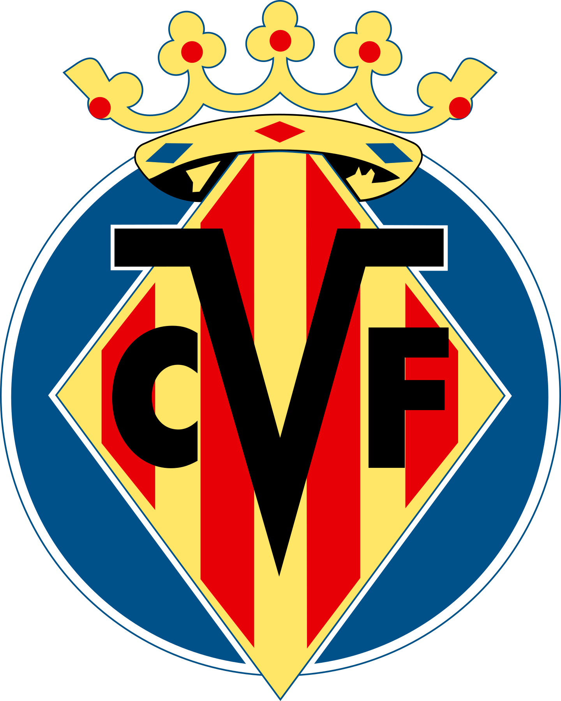

# SORTEADOR FIFA

# Funcionalidade

Existem 50 times cadastrados no total, cada time é um objeto, tendo no seu interior:

- Nome
- Emblema
- País
- Liga
- Estrelas

 
 

Eles estão distribuidos em quatro grupos sendo os seguintes times em cada grupo.

<h1>TIER A<h1>

<h1>TIER B<h1>

<h1>TIER C<h1>

<h1>Brasileirão 2023<h1>

 

# Funcionalidade

- Tier A (Sorteio entre os times do grupo A)
- Tier B (Sorteio entre os times do grupo B)
- Tier C (Sorteio entre os times do grupo C)
- Brasileirão (Sorteio entre os times do Brasileirão 2023 - Baseado no Patch BRFP23)
- Random (Sorteio aleatório entre os times Tier A, B e C)

